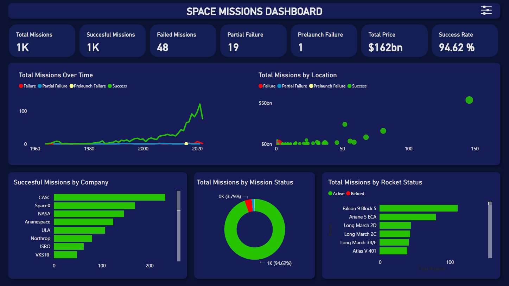

<a name="readme-top"></a>

<div align="center">

  
  <br/>

</div>

<!-- TABLE OF CONTENTS -->

# 📗 Table of Contents

- [📖 About the Project](#about-project)
  - [🛠 Built With](#built-with)
- [💻 Getting Started](#getting-started)
  - [Prerequisites](#prerequisites)
  - [Setup](#setup)
- [👥 Authors](#authors)
- [🤝 Contributing](#contributing)
- [⭐️ Show your support](#support)
- [🙏 Acknowledgements](#acknowledgements)
- [📝 License](#license)

<!-- PROJECT DESCRIPTION -->

# 📖 Space Mission Dashboard <a name="about-project"></a>

The Space Mission Dashboard project provides a comprehensive analysis of all space missions conducted from 1957 to August 2022. Leveraging Power BI, this project dives into a rich dataset, encompassing crucial details such as launch location, date, and outcomes, as well as the responsible space agency. It also explores rocket specifics, including names, prices, and statuses.



</br>

Questions answered with this dashboard

1. How have rocket launches trended across time? Has the mission success rate increased?

2. Which countries have had the most successful space missions? Has it always been that way?

3. Which rocket has been used for the most space missions? Is it still active?

4. Are there any patterns you can notice with the launch locations?

## 🛠 Built With <a name="built-with"></a>


<details>
  <summary>Tech Stack</summary>
  <ul>
    <li>Power BI</li>
    <li>Power Query</li>
    <li>Microsoft Excel</li>
  </ul>
</details>

<!-- GETTING STARTED -->

## 💻 Getting Started <a name="getting-started"></a>

To get a local copy up and running, follow these steps.

### Prerequisites

- Visual Studio Code
- Basic understanding of Power BI & Power Query
- Git Bash

### Setup

Clone this repository to your desired folder:

```sh
git clone https://github.com/HunterX-7/Space-Missions-DA.git
```

<!-- AUTHORS -->

## 👥 Author <a name="authors"></a>

👤 **Francisco Quintero**

- GitHub: [@HunterX-7](https://github.com/HunterX-7)
- LinkedIn: [Francisco Quintero](https://www.linkedin.com/in/francisco-asis-quintero-cede%C3%B1o/)

<!-- CONTRIBUTING -->

## 🤝 Contributing <a name="contributing"></a>

Contributions, issues, and feature requests are welcome!

Feel free to check the [issues page](https://github.com/HunterX-7/Space-Missions-DA/issues).

<!-- SUPPORT -->

## ⭐️ Show your support <a name="support"></a>

Give a ⭐️ if you like this project!

<!-- Acknowledgments -->

## 🙏 Acknowledgments <a name="acknowledgements"></a>

Hat tip to anyone whose code was used.

<!-- LICENSE -->

## 📝 License <a name="license"></a>

This project is [MIT](./LICENSE) licensed.

<p align="right">(<a href="#readme-top">Back to top</a>)</p>
